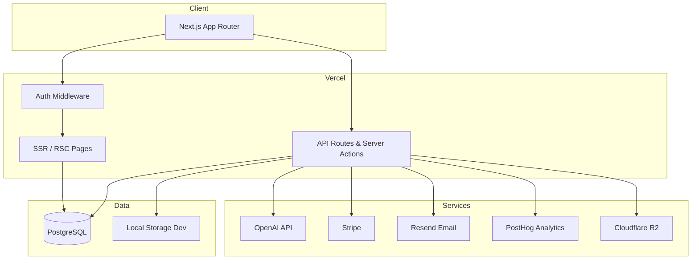
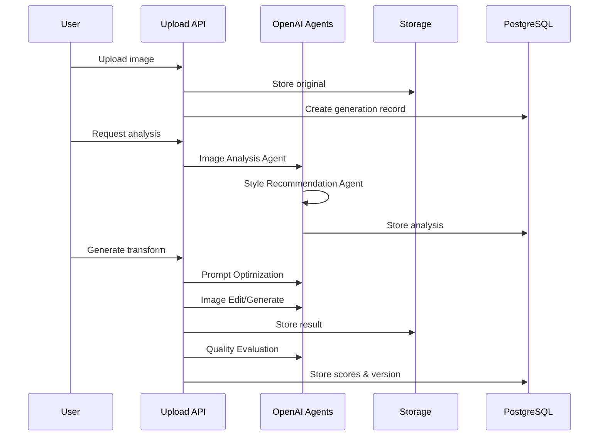

# ArtMorph AI — Production Architecture

## System Overview

## Core Pipeline

## Layer Responsibilities

| Layer | Responsibility |
|-------|----------------|
| `src/app` | Routes, layouts, metadata, SEO |
| `src/actions` | Server Actions for mutations |
| `src/app/api` | REST endpoints, webhooks, uploads |
| `src/lib/ai` | OpenAI agent pipeline |
| `src/lib` | Auth, credits, storage, billing |
| `prisma` | Data model, migrations, seed |

## Security Controls

- JWT sessions via NextAuth
- Role-based admin access
- Rate limiting on upload/transform
- Stripe webhook signature verification
- File type and size validation
- Environment variable validation
- CSRF protection via Server Actions

## Scaling Considerations

- Stateless Next.js instances on Vercel
- PostgreSQL connection pooling (PgBouncer / Neon / Supabase)
- R2 for object storage at scale
- Background job queue recommended for high-volume generation (future)
