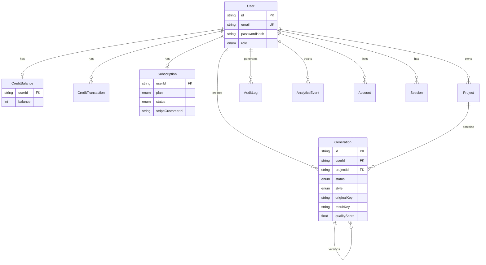

# Database ER Diagram

## Indexes

- `User.email`, `User.role`
- `Generation.userId + createdAt`
- `CreditTransaction.userId + createdAt`
- `Project.userId + name`

## Credit Model

| Action | Cost |
|--------|------|
| Standard transform | 1 credit |
| HD generation | 2 credits |
| Batch generation | 3 credits |
